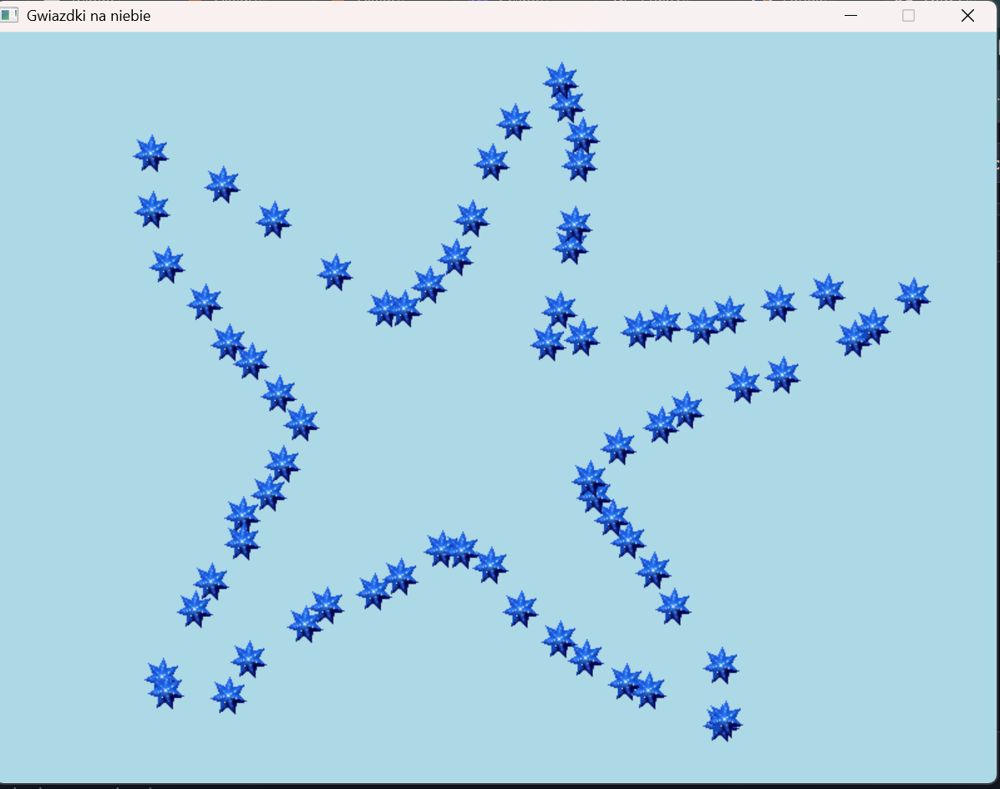

# "Gwiazdki na niebie"

Interaktywna aplikacja desktopowa typu GUI zbudowana w języku C++ z wykorzystaniem bibliotek graficznych SDL2 oraz SDL_image. Projekt demonstruje praktyczne zastosowanie paradygmatu programowania obiektowego (OOP) w kontekście renderowania grafiki 2D w czasie rzeczywistym oraz zaawansowanej obsługi zdarzeń użytkownika.

## Technologie i narzędzia
Język: C++ (standard C++17/20).  
Grafika: SDL2, SDL_image (obsługa tekstur PNG).  
Środowisko: Visual Studio / Visual Studio Code. 
Zarządzanie pamięcią: dynamiczne struktury danych (std::vector).

## Instrukcja uruchomienia
1. Upewnij się, że biblioteki SDL i SDL_image są zainstalowane.  
2. Skompiluj projekt przy użyciu wybranego kompilatora C++.  
3. Uruchom aplikację i korzystaj z funkcji:  
   - Lewy przycisk myszy – rysowanie gwiazdki  
   - Prawy przycisk myszy – czyszczenie ekranu  

## Kluczowe Funkcjonalności
- Dynamiczne renderowanie: Generowanie obiektów (gwiazdek) na warstwie graficznej w miejscu kliknięcia użytkownika.  
- System Event Handling: Obsługa zdarzeń wejścia (myszy) – lewy przycisk (dodawanie obiektu), prawy przycisk (czyszczenie bufora danych).  
- Zarządzanie zasobami: Implementacja poprawnego cyklu życia tekstur i renderera (inicjalizacja, renderowanie, bezpieczne zwalnianie pamięci/Memory Management).  
- Double Buffering: Wykorzystanie mechanizmu SDL_RenderPresent dla płynności wyświetlania obrazu.

## Zrzut z ekranu

## Autor
Monika Campoli
